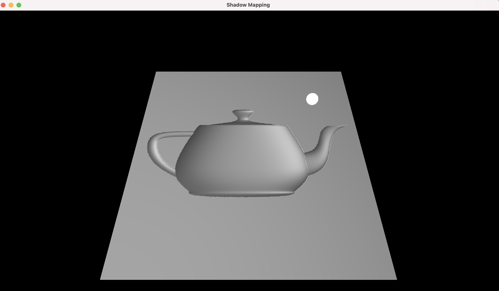
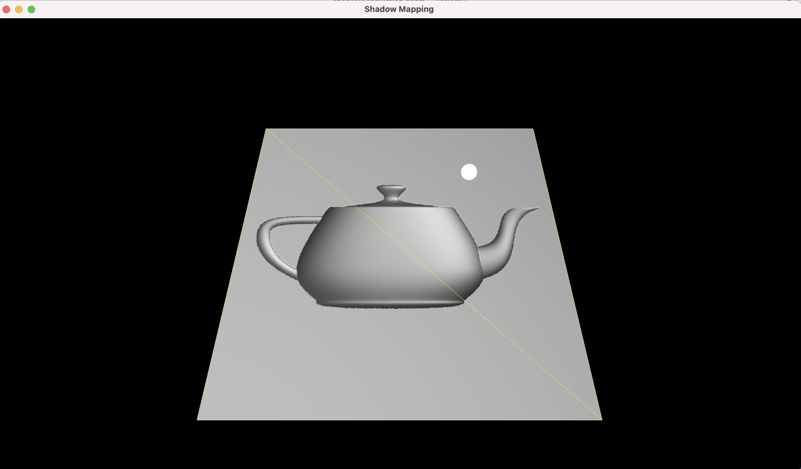
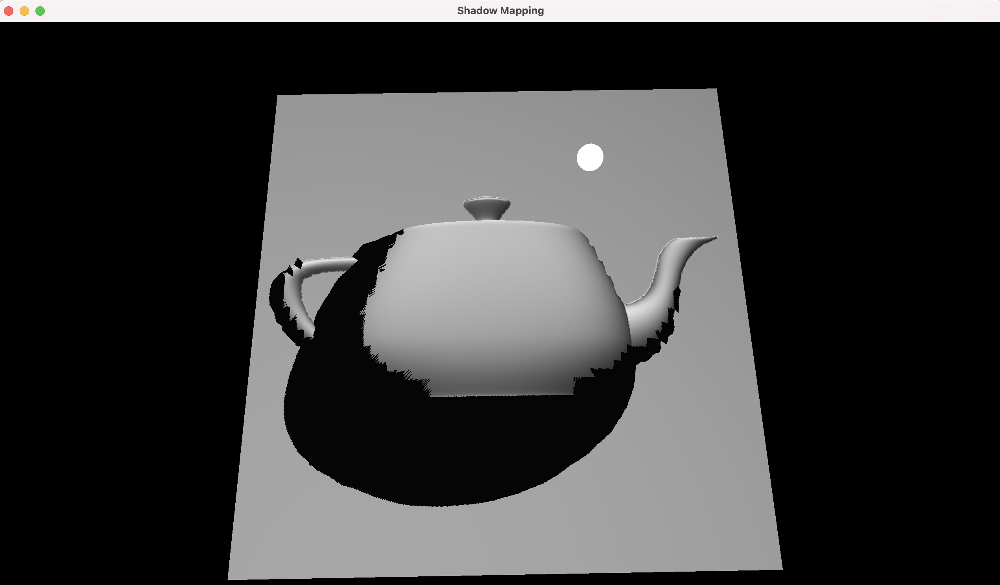
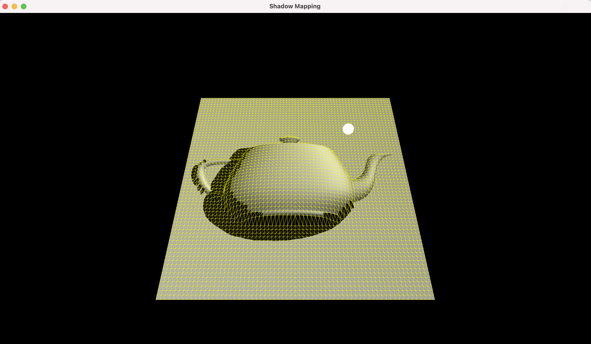

Project 8

Rendering of the plane with the teapot normal map used for shading

Rendering of the plane with the teapot normal map used for shading with triangulation.

Rendering of the shadow casting tesselated plane with the teapot normal map used for shading and the displacement map used for displacing the tessellation triangles with triangulation.

Rendering of the shadow casting tesselated plane with the teapot normal map used for shading and the displacement map used for displacing the tessellation triangles with triangulation.

1. Create VBO for plane vertices and texture coordinates
2. Load normal map texture from png.
3. Create texture for normal map data/Displacement map and bind to texture unit
4. In the main render loop
5. If the user provides only the Normal Map
  1. Draw plane. In fragment shader for plane, sample normal from normal map and shade the plane using sampled normal.
  2. Draw the triangulation using the plane vertices and a Geometry Shader to output line strips to form the sides of the triangles that make up the plane. The plane vertices are translate slightly in the normal direction to prevent occlusion.
6. If the user provides a Normal Map and a Displacement Map
  1. Render Shadow map of the tessellated plane to a depth comparison texture
  2. Draw tessellated plane using patches. The tessellation level is controlled by the tessellation control shader and the model transformations are handled in the tessellation evaluation shader. Sample from shadow map for shadows. The normals are sampled from the normal map for shading.
  3. Draw tessellated plane triangulation is similarly draw(without shadows)
7. The space key toggles the triangulation draw call.
8. Draw the light source.

https://user-images.githubusercontent.com/16291248/211368398-79f7bcf1-b9fb-416a-aae0-0cc7d30b6e41.mp4

How to use your implementation

1. Compile the Tessellation.cpp file, cyCodeBase must be present in the include path

clang++ -std=c++11 -stdlib=libc++ Tessellation.cpp lodepng.cpp -o Tessellation -lglfw -lglew -framework OpenGL -I/Users/u1316087/Downloads/homebrew/include/ -L/Users/u1316087/Downloads/homebrew/lib'

1. Run the executable

./ Tessellation teapot\_normal.png

./ Tessellation teapot\_normal.png teapot\_disp.png

1. Controls

The mouse left button with CNTRL enables rotating the light source in world space.

The mouse left/right button with OPTION/ALT pressed controls the plane

The mouse left/right button pressed controls the object.

What operating system and compiler you used
 Operating System: macOS 11.3 Big Sur

GLFW version: 3.3.6 GLEW version: 2.2.0\_1

Compiler:
 Apple clang version 12.0.5 (clang-1205.0.22.11) Target: x86\_64-apple-darwin20.4.0

External libraries and additional requirements to compile the project.

cyCodeBase, GLFW and GLEW are required
